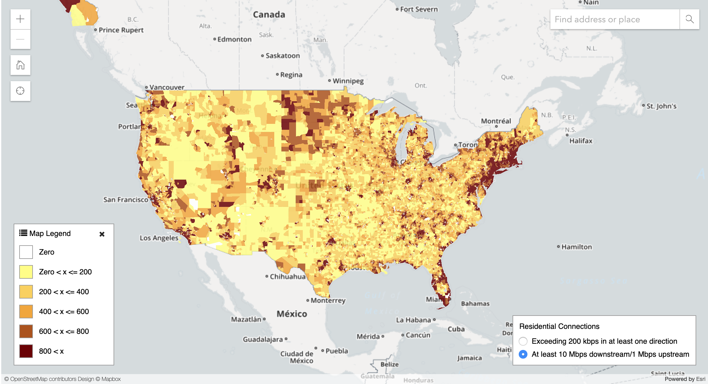
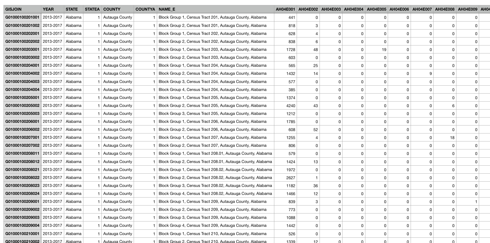

# Data Science Final Project First Blog Post

ʕノ•ᴥ•ʔノ ︵ ┻━┻

### Wassup data science fam? Team m a c h i n e l e a r n i n g here. It’s time to put the bro in broadband jk that doesn’t make any sense but we promise what’s coming next will!

## Project Summary

The goal of our project is to study broadband deployment in the United States and what demographic factors, technologies, and policies can predict internet speeds across the country. More specifically, we want to explore the following questions:

* How did Net Neutrality through Title II common carrier reclassification under the Obama administration (2014) affect broadband deployment and might the return of Net Neutrality hurt internet access as current FCC head Pai claims?
* Did the deployment of 4G cellular networks slow broadband deployment, and might 5G, which promises faster speeds and greater throughput, have a similar but magnified effect?
* How do demographic and geographic factors affect internet speed and deployment (perhaps aside from the obvious like population density, income, and education level)?

## Data Description

We are using highly expansive datasets consisting of data on nationwide broadband internet access from the Federal Communications Commission, as well as all geographical and demographic data from the Census Bureau, specifically, the American Community Survey. The data is made more easily downloadable by the National Historical Geographic Information System, and it is broken down by census block area, which provides data such as educational attainment, race, age, average income, etc. with very high resolution. 

By our first check-in, we had already collected all our data and set up a MySQL instance on GCP. At the time, we were still having problems importing our data into the database, but it turns out that the problem was just the character encoding of our CSV file (shoutout to Jacob for helping us debug!). Saving the data with UTF-8 encoding fixed the problem, and now we have over 220k rows ready for query (omg that rhymes!). 

The following image is an example of a visualization of the raw data provided by the FCC. 

Furthermore, the FCC data is closely correlated with the Census data because the FCC data is sorted geographically on census block. Some raw census data (a small sample out of 220,000+ rows) is shown on a spreadsheet as follows, where GISJOIN is the census block code:

### We hope you’re excited to hear about our next steps, because we have lots of ideas! 

## Next Steps

* Query and save census bureau data that is most related to broadband usage
  * i.e: income, education, race etc.
* Join the FCC data with this Census data along census blocks
* Build sample visualization on a small portion of our data using D3.js
* We are going to run m a c h i n e l e a r n i n g  and (b a b y) b i g d a t a a n a l y s i s on our data
* Calculate correlations and which of these different variables are the best predictors of broadband usage/speed
* Compare these results to our theses 
  * i.e: Did net neutrality increase broadband usage by comparing increase in broadband usage from 2014-2017
  
### That's it for now, see y'all at the next checkpoint! May all your connections be 4g or higher :)
team m a c h i n e l e a r n i n g, signing off ~
