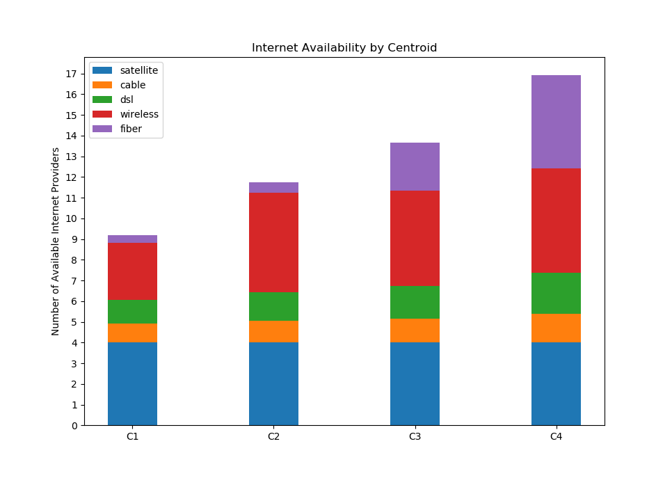

# Data Science Final Project Second Blog Post
&nbsp;&nbsp;&nbsp;&nbsp;&nbsp;&nbsp;Diane Mutako, Hyun Choi, Leon Lei, Raymond Cao | *April 19, 2019*

### Team m a c h i n e l e a r n i n g is back for some round 2 updates! 
We heard this post was optional now, but that's not how our team rolls. We're going to keep this nice and brief and showcase some of the results we have so far. We still have a lot to get to, but as of now we have some updates on our progress in data processing, machine learning, and data visualization.

## Data processing
We've made great progress in data processing. While originally a large roadblock, we mostly have this under control now.

## Machine Learning

> ### K-Means Analysis of Internet Provider Availability in the State of New York (2015)
>
> This code performs an analysis of groupings of municipalities by number of internet service providers available through K-Means. We represented each municipality as a vector of length 5:
>```
>[ # cable providers, # dsl providers, # fiber providers, # wireless providers, # satellite providers ]
>```
>
>#### Hypotheses and Beginning Thoughts
>
>We originally thought that there would be 2 main clusters: one that consisted of rural households that had access to few internet service providers, and one that consisted of urban and suburban households that had access to many more providers. We also expected that the number of people in the former cluster would outnumber the people in the latter cluster.
>
>#### Finding K
>
>To find the ideal value of K to perform the K-Means analysis, we plotted the errors (inertia) for values of K from 1 to 15 (inclusive) and found that 4 was best value as shown below.
>
>
>
>#### K-Means Analysis
>
>With `K=4`, we ran K-Means analysis 1000 times, and we found that the averages of the 4 centroids were the following (each row is a centroid):
>
>```
>  cable      dsl        fiber      wireless   satellite
>[[0.92470371 1.13378801 0.34721665 2.79396034 4.        ]
> [1.05091665 1.37298036 0.50663221 4.86298947 4.        ]
> [1.17256513 1.55794908 2.29653245 4.57346084 4.        ]
> [1.38594809 1.99346829 4.49734056 5.04028195 4.        ]]
>```
>Satellite seemed to have no significance, which made sense because it, by nature of the technology, is not heavily impacted by geography.
>
>We also plotted a histogram to see how many municipalities were grouped with each of the centroids. Each bar (shown below) from the left to right correspond to the centroids (shown above) from top to bottom.
>
>
>
>#### Conclusions
>
>Our first hypothesis was disproved in this analysis because there turned out to be 4 cluster rather than 2. While there were more people in the clusters with fewer provider choices, we were also surprised to see that the largest cluster was the one with the second-least number of choices.
>
>The main thing that distinguished the two clusters with the least number of internet service providers was the number of wireless providers (cellular networks) available. The largest group turned out to have more wireless choices -- in fact, it has the second-most number of choices. Considering that this large cluster had almost no fiber internet providers available, this may suggest that te presence of a robust wireless network may discourage the development of faster, more costly networks like fiber.
>
>#### Data Source
>
>The data used to perform this analysis was downloaded as a CSV from these sources:
>  * https://catalog.data.gov/dataset/broadband-availability-by-municipality
>  * https://data.ny.gov/Economic-Development/Broadband-Availability-By-Municipality/sjc6-ftj4


## Data Visualization
We built a mini-framework for visualizing our data in scatterplot format, and this can eventually be extended to support other types of visualizations. As it stands now, our plot can easily be made interactive and allow users to choose which columns to sizeBy, colorBy, and which columns to use for the X-axis and Y-axis. The plot has zooming capabilities that take advantage of D3 Brush, and hovering over a datapoint will reveal some information about it.

<head>
        <meta charset="utf-8">
        <title>NY State Broadband Availability</title>
        <script type="text/javascript" src="https://d3js.org/d3.v5.min.js"></script>
        <style type="text/css">
            .dot {
                stroke: #999;
            }
        </style>
    </head>
    
<div id="header">
            <h1>NY State Broadband Availability by Municipality</h1>
        </div>
        <div id="chart">
        </div>
        <div id="inputs">
        </div>
        <!--feel free to add style rules or just add styles directly to the d3 components-->
        <script type="text/javascript">
            // CODE GOES HERE
            d3.csv("data.csv").then(data => {
                console.log(data);
                const label = d => {
                    return "<b>Muni Name</b>: " + d["Municipality Name"] + "<br><b>County</b>: " + d["County"] + "<br>";
                }
                let sizeBy = "2010 Muni Housing Units"
                let xBy = "# Hse Units DSL"
                let yBy = "# Hse Units Cable"
                let colorBy = "REDC Region"
                let radius = d => {
                    return parseFloat(d[sizeBy])
                }
                let x = d => {
                    return parseFloat(d[xBy])
                }
                let y = d => {
                    return parseFloat(d[yBy])
                }
                let color = d => {
                    return d[colorBy]
                }
                // Chart dimensions
                const margin = {top: 20, right: 20, bottom: 110, left: 50};
                const margin2 = {top: 430, right: 20, bottom: 30, left: 40}
                const width = 960 - margin.left - margin.right;
                const height = 500 - margin.top - margin.bottom;
                const height2 = 500 - margin2.top - margin2.bottom;
                let xScale = d3.scaleLinear()
                    .domain([0, 1800000])
                    .range([0, width])
                let x2Scale = d3.scaleLinear()
                    .domain(xScale.domain())
                    .range([0, width])
                let yScale = d3.scaleLinear()
                    .domain(xScale.domain())
                    .range([height, 0])
                let y2Scale = d3.scaleLinear()
                    .domain(yScale.domain())
                    .range([height2, 0])
                const maxSize = d3.extent(data, radius)[1]
                let sizeScale = d3.scaleLinear().domain([0, 20000]).range([0, 10])
                let colorScale = d3.scaleOrdinal(d3.schemeCategory10);
                const xAxis = d3.axisBottom(xScale).ticks(12, d3.format(",d"))
                const yAxis = d3.axisLeft(yScale).ticks(12, d3.format(",d"))
                const brushX = d3.brushX()
                    .extent([[0, 0], [width, height2]])
                    .on("brush end", brushedX);
                const svg = d3.select("#chart")
                    .append("svg")
                    .attr("width", width + margin.left + margin.right)
                    .attr("height", height + margin.top + margin.bottom)
                const xlabel = svg.append("text")
                    .attr("class", "x label")
                    .attr("text-anchor", "end")
                    .attr("x", width + margin.left)
                    .attr("y", height + 10)
                    .text(xBy);
                const ylabel = svg.append("text")
                    .attr("class", "y label")
                    .attr("transform", "rotate(270)")
                    .attr("text-anchor", "end")
                    .attr("y", margin.left + 20)
                    .text(yBy);
                svg.append("defs").append("clipPath")
                    .attr("id", "clip")
                    .append("rect")
                    .attr("width", width)
                    .attr("height", height);
                let focus = svg.append("g")
                    .attr("class", "focus")
                    .attr("transform", "translate(" + margin.left + "," + margin.top + ")");
                let context = svg.append("g")
                    .attr("class", "context")
                    .attr("transform", "translate(" + margin2.left + "," + margin2.top + ")");
                var div = d3.select("body").append("div")   
                    .attr("class", "tooltip")               
                    .style("opacity", 0);
                var nodes = focus.append("g");
                nodes.attr("clip-path", "url(#clip)");
                nodes.selectAll("dot")
                    .data(data)
                    .enter()
                    .append("circle")
                    .attr("class", "dot")
                    .attr("cx", d => {
                        return xScale(x(d));
                    })
                    .attr("cy", d => {
                        return yScale(y(d));
                    })
                    .attr("r", d => {
                        return sizeScale(radius(d));
                    })
                    .style("fill", d => {
                        return colorScale(color(d));
                    })
                    .style("opacity", "0.8")
                    .on("mouseover", function(d) {     
                        div.transition()
                            .duration(200)      
                            .style("opacity", .9);      
                        div.html(label(d) + "<b>" + sizeBy + "</b>: " + d[sizeBy] + "<br><b>" + xBy + "</b>: " + d[xBy] + "<br><b>" + yBy + "</b>: " + d[yBy])
                            .style("left", (d3.event.pageX) + "px")     
                            .style("top", (d3.event.pageY) + "px");    
                        })                  
                    .on("mouseout", function(d) {       
                        div.transition()        
                            .duration(500)      
                            .style("opacity", 0);   
                    });
                focus.append("g")
                    .attr("class", "axis axis--x")
                    .attr("transform", "translate(0," + height + ")")
                    .call(xAxis);
                focus.append("g")
                    .attr("class", "axis axis--y")
                    .call(yAxis);
                var nodes = context.append("g");
                    nodes.attr("clip-path", "url(#clip)");
                    nodes.selectAll("dot")
                        .data(data)
                        .enter()
                        .append("circle")
                        .attr("class", "dotContext")
                        .attr("r", 3)
                        .style("opacity", 0.3)
                        .attr("cx", d => { return x2Scale(x(d));})
                        .attr("cy", d => { return y2Scale(y(d));})
                context.append("g")
                    .attr("class", "axis axis--x")
                    .attr("transform", "translate(0," + height2 + ")")
                context.append("g")
                    .attr("class", "brush")
                    .call(brushX)
                    .call(brushX.move, [xScale.range()[0], xScale.range()[1] / 60]);
                function brushedX() {
                    var selection = d3.event.selection;
                    if (selection[1] < 0.8) {
                        selection[1] = 0.8;
                    }
                    xScale.domain(selection.map(x2Scale.invert, x2Scale));
                    yScale.domain(selection.map(x2Scale.invert, x2Scale));
                    focus.selectAll(".dot")
                        .attr("cx", function(d) { return xScale(x(d)); })
                        .attr("cy", function(d) { return yScale(y(d)); });
                    focus.select(".axis--x").call(xAxis);
                    focus.select(".axis--y").call(yAxis);
                }
            });
            
        </script>
  
### That's it for now, see y'all at the next checkpoint! May all your connections be 4g or higher :)
team m a c h i n e l e a r n i n g, signing off ~
