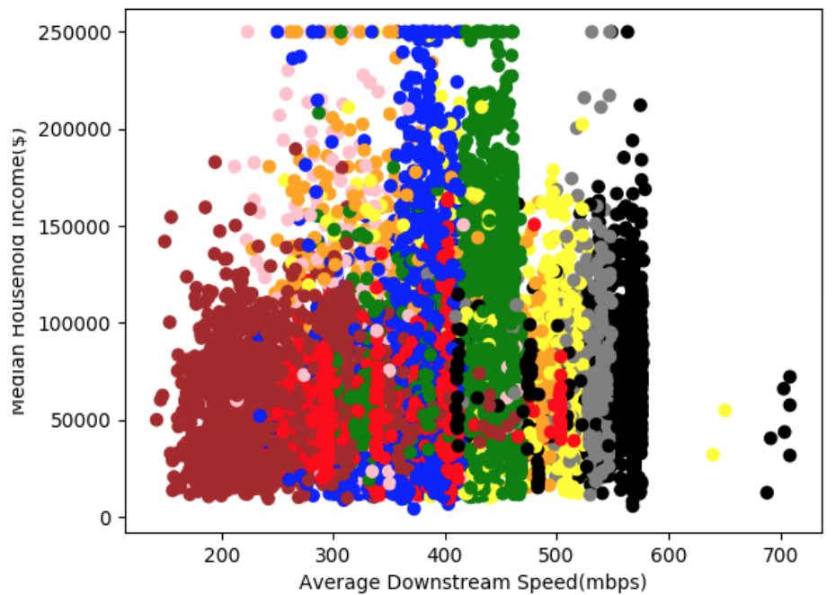
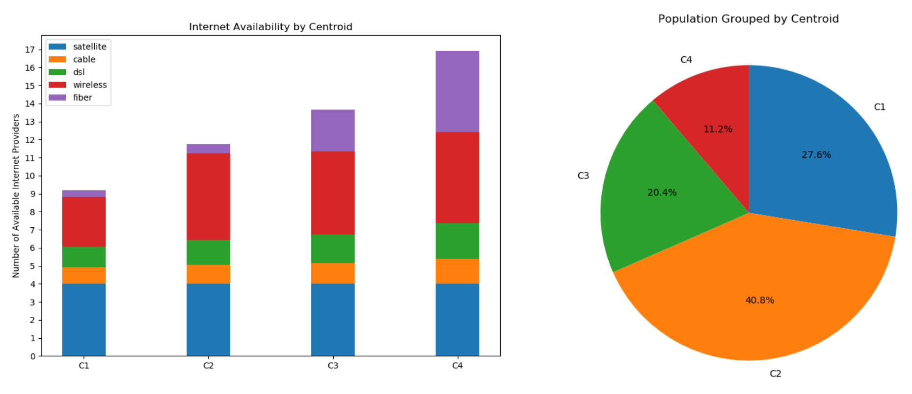
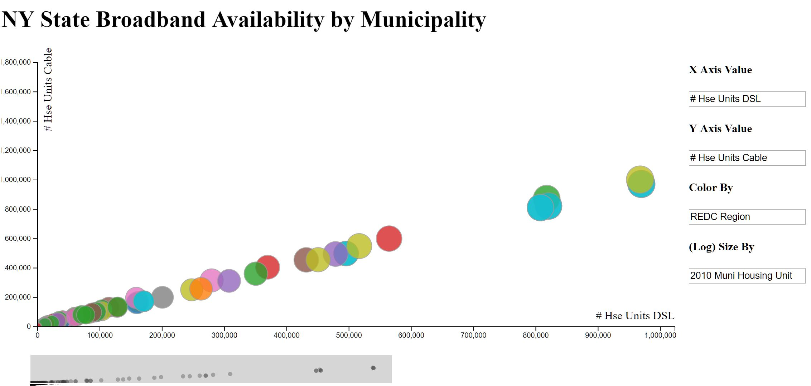
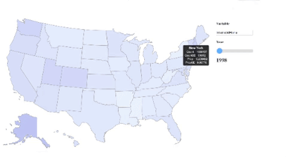

# Data Science Final Project Final Blog Post
&nbsp;&nbsp;&nbsp;&nbsp;&nbsp;&nbsp;Diane Mutako, Hyun Choi, Leon Lei, Raymond Cao | *May 4, 2019*

## Vision
The overall goal of our project was to gain a clearer understanding of the current state of broadband internet deployment in the United States. This not only included looking at the raw speeds that Americans were seeing in their homes, but also looking at the possible correlations between deployment, speeds, service provider choice, internet delivery network technology, region, and socioeconomic background.

With this knowledge in hand, we wanted to know what to expect from future broadband deployment, especially considering current government and private investment in bridging the “digital divide” and the introduction of newer technologies such as 5G and wireless gigabit networks.

We initially expected to find two distinct groups of Americans:
 1) those who lived in sparsely populated areas with with little ISP (internet service provider) choice and slower and more expensive service
  2) those who lived in densely populated areas with many (more than 5) ISP choices and good quality service
We also expected to see significantly more and better broadband internet in higher-educated, wealthier communities.

While a good part of our hypotheses were backed up by the analyses that we performed, the results that conflicted with our initial beliefs show the promise of more recent pushes to develop American broadband.

## Data & Challenges
Finding workable data for our analyses was trickier than we expected because there was an overwhelming amount of data from reputable sources such as the FCC. Most of the data sets that we used were either directly from the FCC, or were derived from FCC data. Although the FCC data was cleaned and well-formatted, working with 11 gigabyte CSV (comma separated values) files for each year (or half-year) was cumbersome. Funnily enough, the limitations of internet bandwidth constrained the amount of data that we were realistically able to process. Thus, we made the assumption that specific states were representative of the state of the country and decided to focus on the broadband rollout in specific states rather than for the whole country. We imported the data for two state (NY and CA) onto a MySQL database on our Google Cloud Platform server. We queried the database using MySQLWorkbench. 

In the end, most of our analyses were performed on data pre-filtered on state or internet technology type. For example, some of the analysis done on New York came from data uploaded by the state of New York to data.gov.

On the flip side, there was some information that we had significant difficulty in finding. We could not find comprehensive, trustworthy data on cellular network coverage to compare with our broadband data. We also faced issues finding data that matched with each other chronologically. The FCC data was released every 6 months for 2015-2017, but we could not find data from the Census that were released at the same times, so we could not perform analyses on changes over time.

## Methodology
We performed 5 analyses for this project:
  - K-means analysis on household income and download speeds in New York
  - K-means analysis on the available internet service technologies for all municipalities in New York
  - D3 scatterplot visualization tool (used on multiple data sets)
  - D3 data over US geography visualization (used on multiple data sets)
  - Plot.ly state-wide county-level analysis on relationship between education level, income, internet speeds, and internet network technologies in New York and California

## Results
### New York Income & Speed K-means Analysis
  - We did a K-means analysis of the average speed/technology available in all New York block groups to see if the clusters would form around the median household income to indicate a correlation between these two variables.
  - We graphed the clusters’ overall average speed against the Median Household Income of each point to observe this correlation or lack of.
  - As seen in the graph below, the clusters are not grouped around certain income levels. The only slight difference from cluster to cluster is the overall average speed in that region. Therefore, we concluded that there is no direct correlation between the Median Household income of an area and the average downstream speed/technology in that area. 
  - In New York, this can likely be attributed to the high number of available technologies and providers. Although these technologies do have different downstream speeds from area to area, this analysis confirms that this difference is not due to the income levels in the area.
  - Below is a graph of the clusters graphed against the Median Household Income. The submitted folder also includes pie-chart graphs indicating how much each technology code contributes to the overall speed in the area. Here is a short description of the technology codes represent. 

### New York Internet Availability K-means Analysis
  - We broke down internet availability in each municipality by technology (DSL, cable, fiber, wireless, satellite) and analyzed the distribution of each access technology across the state
  - Found four distinct clusters: one with few choices overall, one with significant wireless choice, and two with many choices
  - Most people were grouped with the centroid with many wireless internet services, but few other choices
  - The existence of the second centroid suggests that wireless connection technologies may suppress the development of faster, more expensive solutions like fiber, though they likely have and will play a major role in reducing the digital divide
  - The popularity of wireless internet suggests that home broadband delivered through 5G cellular networks may become popular since the technology behind 5G is similar to wireless range-wise

### D3 Scatterplot

We used D3 to create an interactive scatterplot visualization framework that works on most csv files. Upon loading in a csv file, the code will dynamically find all available columns using the first row as the column header names. The user can then choose which variables to plot on the x or y axis, as well as which variables to color or size the plots of the scatter by. We restricted the x axis, y axis, and size by options to only columns with numerical data, whereas the color by also works with categorical data. Other features include hovering over labels to view relevant information, as well as using D3 brush to pan and change the extent of the plotted axis. The demo linked above uses the [New York dataset](https://catalog.data.gov/dataset/broadband-availability-by-municipality). While we did not find any notable/unexpected trends, having this scatterplot visualizer was still useful for getting an overall idea and scale of the corresponding datasets.

### D3 Choropleth

Much of our other analyses had little to do with the development of broadband in the U.S. over time. In order to get a better idea of the temporal changes in U.S. Broadband usage, we produced a D3 choropleth visualization inspired by [this bl.ock](http://bl.ocks.org/NPashaP/a74faf20b492ad377312). We started off with just a simple map vis of the U.S. and augmented it by dynamically processing our data (the [NTIA dataset](https://catalog.data.gov/dataset/broadband-adoption-and-computer-use-by-year-state-demographic-characteristics)) to focus on a single variable based on the user’s input. We also included a slider that could be used to scroll through the various years in which that variable was collected. In the UI, users get to see all available variables as well as their descriptions as options for input, and this is all generated dynamically by the code. Once again, while these visualizations did not have a direct contribution to our analyses and results, they were great at helping us to understand the dataset in a more intuitive way. Some variables that we think are cool to look at are `internetAtHome` and `dialUpAtHome`.

### Statistical Analysis on Household Income & Internet Usage
While the correlation between household income and internet speed was not as clear, the correlation between household income and internet usage was much stronger. Using the [NTIA dataset](https://catalog.data.gov/dataset/broadband-adoption-and-computer-use-by-year-state-demographic-characteristics), we conducted upper-tailed two-proportion Z-tests for internet usage at home for people in each income bracket (<$25k, $25k-49k, $50k-74k, $75k-99k, >$100k) against all income brackets above them to determine if the difference in internet usage was statistically significant (α = 0.001). Across the board, higher income brackets had statistically significantly greater rates of internet usage at home than lower income brackets. This was true for all years when data was collected, i.e. between 2010-2017 (excluding 2014 and 2016, when no income data was collected).

### Choropleth Maps for New York & California
<iframe frameborder="0" scrolling="no" src="//plot.ly/~hyunchoi98/18.embed"></iframe>

<iframe frameborder="0" scrolling="no" src="//plot.ly/~hyunchoi98/12.embed"></iframe>

<iframe frameborder="0" scrolling="no" src="//plot.ly/~hyunchoi98/24.embed"></iframe>

<iframe frameborder="0" scrolling="no" src="//plot.ly/~hyunchoi98/20.embed"></iframe>

The choropleth maps show the median household income and average speed of cable providers in each county in New York and California. Census data from the American Community Survey 2017 as well as the [FCC Fixed Broadband Deployment Data](https://www.fcc.gov/general/broadband-deployment-data-fcc-form-477) were used. The maps further demonstrate the small (if any) correlation between median household income and internet speed. For these maps, only cable provider speeds were used for uniformity. Cable is the most commonly used broadband technology in the United States but there are various cable technologies that causes cable speeds to vary between different areas. This makes cable an ideal technology to use to view the speed differences between areas. Meanwhile, DSL is much too slow, and fiber internet—if offered in an area—almost always results in speeds near 1000 mbps, both of which would skew the data too much. 

## Conclusions
  - The “digital divide” does indeed exist, though the border may sometimes be less distinct depending on the metrics focused upon.
  - Wireless internet service and other similar technologies like 5G Cellular networks may play a key role in increasing ISP choice for Americans since they have lower infrastructure hurdles.
  - The strong correlation between income and internet usage at home is a somewhat different comparison than between income and internet speed. Firstly, if a technology is available in an area, it is natural that the entire region would have internet speeds that reflect the available technologies. However, on a more granular, census-level dataset, we were able to see what proportion of people actually took advantage of the available infrastructure. On the household level, several other conditions must be satisfied before internet can be used at home. For example, there may be no need for internet at home if the household doesn’t even own internet-accessing devices, e.g. a computer.

## Data Sources
  - FCC Dataset: https://www.fcc.gov/general/broadband-deployment-data-fcc-form-477
    - This dataset contains broadband deployment data for the entire country and links to the data for New York and California, the only states we did this analysis on.
  - Census Bureau Dataset: https://drive.google.com/a/brown.edu/file/d/13lV1-9WKhyKlk2B5xAP5N2OzRo8G7jjv/view?usp=sharing
    - This links to a csv file on google drive which contains Median Household income for New York. 
  - Broadband availability per municipality in New York (file included in repo under `kmeans_availability_ny`)
  - NTIA (National Telecommunications and Information Administration) Dataset: https://www.ntia.doc.gov/data/digital-nation-data-explorer#sel=internetUser&demo=&pc=prop&disp=both

