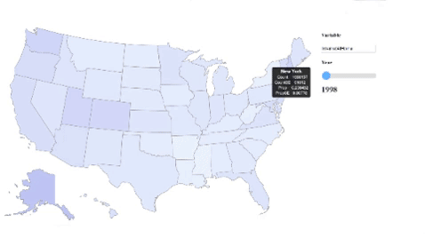
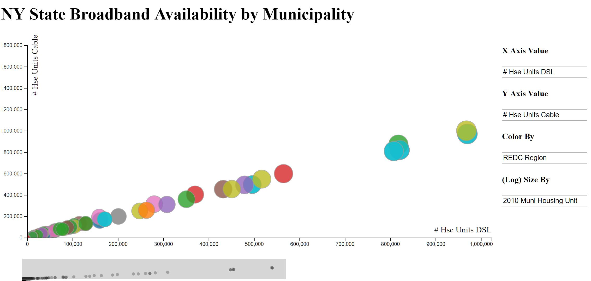

Click [here](https://dmutako.github.io/data-science-final-project/) or on the title above to return to the homepage!

These are additional interactive visualizations that we created but did not include in our Poster. 
Click on one of the header links or images below to view them!

# [Choropleth Time Visualization](https://bl.ocks.org/leibo123/raw/e6644701e644c9243c2e19e6c95b059f/0ccd926b28539ebb1203189ecfc1b28231498074/)

Dynamically loads all available variables from [this](https://catalog.data.gov/dataset/broadband-adoption-and-computer-use-by-year-state-demographic-characteristics) dataset and includes a slider for viewing the available data at each year. Displays state-specific information on hover.

# [Interactive Scatter Visualization](https://bl.ocks.org/leibo123/raw/4286a693e1196a93addb8c4dd5c37f54/39f826f005e220ccd51e254c26752940d8d2250e/)

This visualization can be used as its own framework on other data sources - for the most part this just requires changing the CSV file. The code will dynamically loads all possible columns as input and allow users to choose which variables to plot on the x or y axis, and which variables to color or size the scatter by. The current demo uses [this](https://catalog.data.gov/dataset/broadband-availability-by-municipality) dataset.

