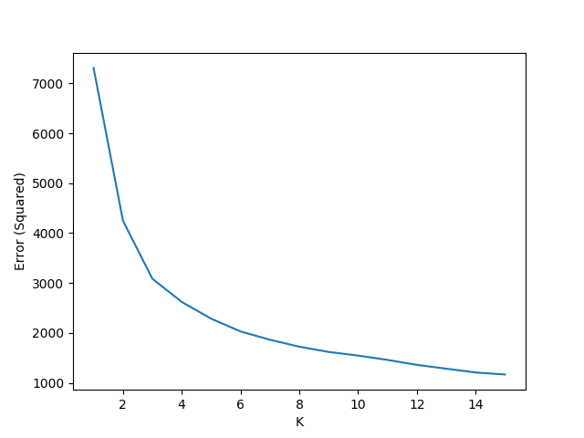
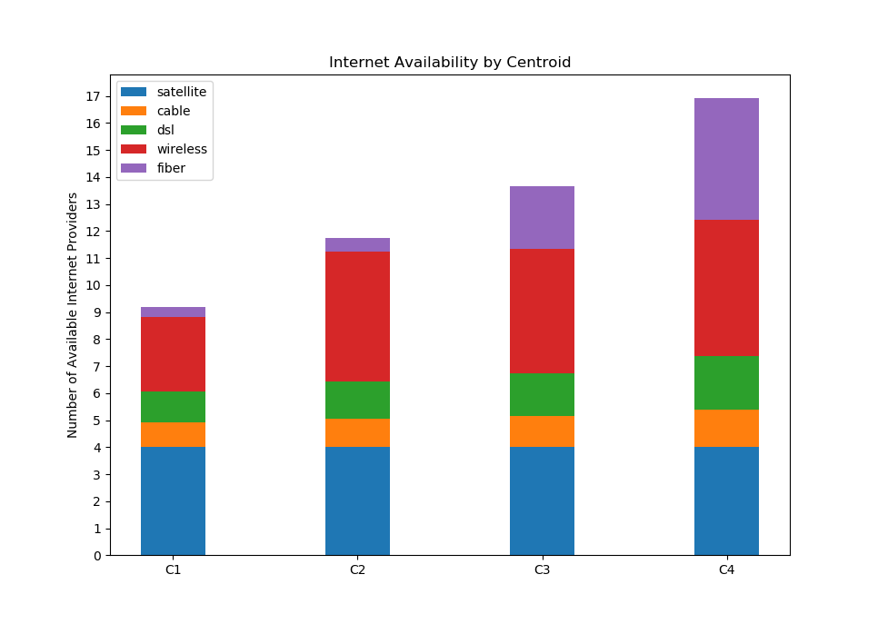

# K-Means Analysis of Internet Provider Availability in the State of New York (2015)

This code performs an analysis of groupings of municipalities by number of internet service providers available through K-Means. We represented each municipality as a vector of length 5:
```
[ # cable providers, # dsl providers, # fiber providers, # wireless providers, # satellite providers ]
```

## Hypotheses and Beginning Thoughts

We originally thought that there would be 2 main clusters: one that consisted of rural households that had access to few internet service providers, and one that consisted of urban and suburban households that had access to many more providers. We also expected that the number of people in the former cluster would outnumber the people in the latter cluster.

## Finding K

To find the ideal value of K to perform the K-Means analysis, we plotted the errors (inertia) for values of K from 1 to 15 (inclusive) and found that 4 was best value as shown below.



## K-Means Analysis

With `K=4`, we ran K-Means analysis 1000 times, and we found that the averages of the 4 centroids were the following (each row is a centroid):

```
  cable      dsl        fiber      wireless   satellite
[[0.92470371 1.13378801 0.34721665 2.79396034 4.        ]
 [1.05091665 1.37298036 0.50663221 4.86298947 4.        ]
 [1.17256513 1.55794908 2.29653245 4.57346084 4.        ]
 [1.38594809 1.99346829 4.49734056 5.04028195 4.        ]]
```
Satellite seemed to have no significance, which made sense because it, by nature of the technology, is not heavily impacted by geography.

We also plotted a histogram to see how many municipalities were grouped with each of the centroids. Each bar (shown below) from the left to right correspond to the centroids (shown above) from top to bottom.



## Conclusions

Our first hypothesis was disproved in this analysis because there turned out to be 4 cluster rather than 2. While there were more people in the clusters with fewer provider choices, we were also surprised to see that the largest cluster was the one with the second-least number of choices.

The main thing that distinguished the two clusters with the least number of internet service providers was the number of wireless providers (cellular networks) available. The largest group turned out to have more wireless choices -- in fact, it has the second-most number of choices. Considering that this large cluster had almost no fiber internet providers available, this may suggest that te presence of a robust wireless network may discourage the development of faster, more costly networks like fiber.

## Notes for Running Our Script

The script used for the analysis, `kmeans_ny.py`, requires Python 3 to run and has the following dependencies:
  * matplotlib
  * numpy
  * scipy
  * sklearn
  * csv

To run, just navigate to this directory and run:
```
python kmeans_ny.py
```

## Data Source

The data used to perform this analysis was downloaded as a CSV from these sources:
  * https://catalog.data.gov/dataset/broadband-availability-by-municipality
  * https://data.ny.gov/Economic-Development/Broadband-Availability-By-Municipality/sjc6-ftj4
